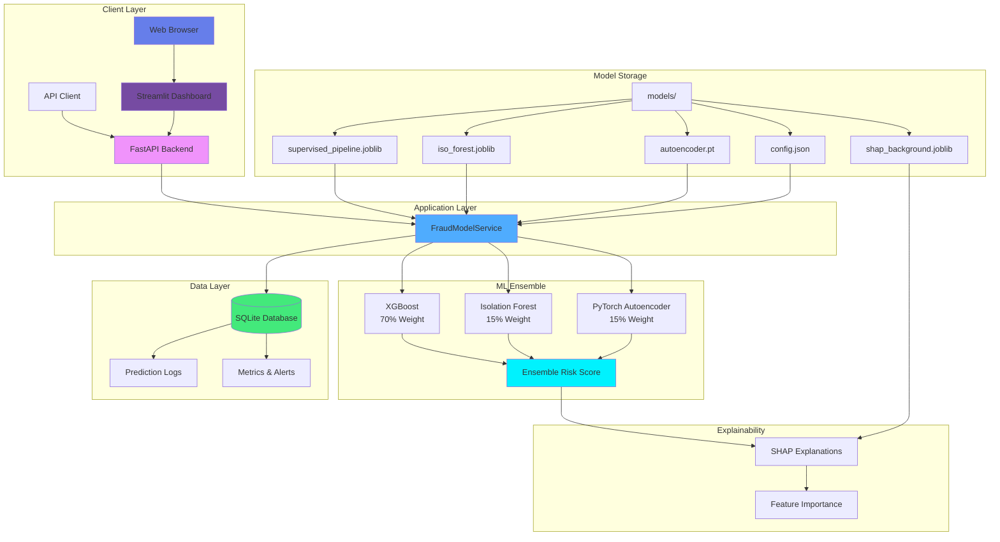

# 🛡️ FinSecure AI — Advanced Real-Time Fraud Detection Platform

[](https://github.com/vijayshreepathak/FinSecure-Ai)
[](https://www.python.org/)
[](https://fastapi.tiangolo.com/)
[](https://streamlit.io/)
[](LICENSE)

> **FinSecure AI** is a production-grade, end-to-end fraud detection system powered by an ensemble of machine learning models. Built on the Kaggle Credit Card Fraud Detection dataset, it provides real-time fraud detection with explainable AI, comprehensive monitoring, and an advanced modern dashboard.

## 📋 Table of Contents

- [Features](#-key-features)
- [System Architecture](#-system-architecture)
- [Technology Stack](#-technology-stack)
- [Project Structure](#-project-structure)
- [Quick Start](#-quick-start)
- [Installation](#-installation)
- [Training Models](#-training-models)
- [Running the Application](#-running-the-application)
- [API Documentation](#-api-documentation)
- [Dashboard Features](#-dashboard-features)
- [Docker Deployment](#-docker-deployment)
- [Testing](#-testing)
- [Contributing](#-contributing)
- [License](#-license)

## ✨ Key Features

### 🤖 Advanced ML Ensemble
- **XGBoost Classifier (70% weight)**: Supervised learning with SMOTE for class imbalance handling
- **Isolation Forest (15% weight)**: Unsupervised anomaly detection for novel fraud patterns
- **PyTorch Autoencoder (15% weight)**: Deep learning reconstruction error for complex pattern detection
- **Weighted Ensemble Risk Score**: Combines all three models for robust fraud detection

### 🚀 FastAPI Backend
- **RESTful API** with comprehensive endpoints
- **Real-time Inference**: Single and batch transaction processing
- **SHAP Explainability**: Feature importance for each prediction
- **SQLAlchemy Logging**: All predictions logged to SQLite (easily migratable to PostgreSQL)
- **Health Monitoring**: System status and performance metrics
- **Alert System**: Real-time fraud alerts with configurable thresholds

### 📊 Advanced Dashboard
- **Modern Dark Theme UI**: Beautiful gradient-based interface with glass-morphism effects
- **Multi-Module Navigation**: 
  - 🏠 **Dashboard**: Real-time KPIs, gauges, charts, and metrics
  - 🔍 **Detection Lab**: Single transaction analysis, batch processing, scenario testing
  - 📊 **Analytics**: Fraud activity heatmaps, pattern analysis, live alerts
  - ⚙️ **Model Info**: Detailed architecture documentation
  - 📈 **Performance**: System health monitoring and confusion matrix
- **Interactive Visualizations**: 
  - Gauge charts for fraud rates
  - 3D donut charts for distribution
  - Risk score distribution bars
  - 24-hour timeline charts
  - Weekly fraud activity heatmaps
  - SHAP feature importance charts
- **Real-time Updates**: Auto-refresh functionality with configurable intervals
- **Settings Panel**: Adjustable alert thresholds and system preferences
- **Quick Stats**: Instant overview of system performance

### 🔬 Explainable AI
- **SHAP Values**: Understand which features contribute to each prediction
- **Model Insights**: Breakdown of ensemble model contributions
- **Feature Importance**: Visual representation of top contributing features
- **Transparency**: Full explainability for regulatory compliance

### 🐳 Containerization
- **Docker Support**: Fully containerized services
- **Docker Compose**: One-command deployment
- **Training Container**: Isolated model training environment

## 🏗️ System Architecture



### Architecture Components

1. **Client Layer**
   - Streamlit Dashboard (Port 8501/8502)
   - REST API Clients

2. **Application Layer**
   - FastAPI Backend (Port 8000)
   - FraudModelService (Model orchestration)

3. **ML Ensemble**
   - XGBoost Classifier
   - Isolation Forest
   - PyTorch Autoencoder
   - Weighted ensemble combination

4. **Data Layer**
   - SQLite Database (fraud.db)
   - Prediction logging
   - Metrics aggregation

5. **Model Storage**
   - Trained model artifacts
   - Configuration files
   - SHAP background data

## 🛠️ Technology Stack

### Backend
- **FastAPI**: High-performance async web framework
- **SQLAlchemy**: ORM for database operations
- **Pydantic**: Data validation and settings management

### Machine Learning
- **XGBoost**: Gradient boosting framework
- **Scikit-learn**: Isolation Forest and preprocessing
- **PyTorch**: Deep learning autoencoder
- **SHAP**: Model explainability
- **Imbalanced-learn**: SMOTE for class balancing

### Frontend
- **Streamlit**: Interactive web dashboard
- **Plotly**: Advanced interactive visualizations
- **Custom CSS**: Modern dark theme with animations

### Infrastructure
- **Docker**: Containerization
- **Docker Compose**: Service orchestration
- **SQLite**: Lightweight database (production-ready for PostgreSQL)

## 📁 Project Structure

```
FinSafe-Ai/
├── app/                          # FastAPI backend
│   ├── main.py                  # API endpoints and application setup
│   ├── model.py                 # FraudModelService and ML models
│   ├── db.py                    # Database models and operations
│   └── schemas.py               # Pydantic request/response models
├── dashboard/                    # Streamlit dashboards
│   ├── app.py                   # Original dashboard
│   └── app_advanced.py          # Advanced modern dashboard ⭐
├── models/                       # Trained model artifacts
│   ├── supervised_pipeline.joblib
│   ├── iso_forest.joblib
│   ├── autoencoder.pt
│   ├── preprocessor.joblib
│   ├── shap_background.joblib
│   └── config.json
├── scripts/                      # Training scripts
│   └── train_model.py           # Model training pipeline
├── tests/                        # Unit tests
│   └── test_api.py              # API endpoint tests
├── finsecure_ai.ipynb           # Jupyter notebook for EDA and training
├── docker-compose.yml           # Docker orchestration
├── Dockerfile                    # API container
├── Dockerfile.train             # Training container
├── requirements.txt             # Python dependencies
└── README.md                    # This file
```

## 🚀 Quick Start

### Prerequisites

- Python 3.8+
- Docker and Docker Compose (optional)
- Credit Card Fraud Detection dataset (`creditcard.csv`)

### Installation

1. **Clone the repository**
   ```bash
   git clone https://github.com/vijayshreepathak/FinSecure-Ai.git
   cd FinSecure-Ai
   ```

2. **Create virtual environment**
   ```bash
   python -m venv .venv
   
   # Windows
   .venv\Scripts\activate
   
   # Linux/Mac
   source .venv/bin/activate
   ```

3. **Install dependencies**
   ```bash
   pip install --upgrade pip
   pip install -r requirements.txt
   ```

4. **Add dataset**
   - Place `creditcard.csv` in the project root directory
   - Download from [Kaggle Credit Card Fraud Detection](https://www.kaggle.com/datasets/mlg-ulb/creditcardfraud)

## 🎓 Training Models

### Option 1: Using Training Script

```bash
python scripts/train_model.py
```

### Option 2: Using Jupyter Notebook

```bash
jupyter notebook finsecure_ai.ipynb
```

### Training Output

The training pipeline creates the following artifacts in `models/`:

- `supervised_pipeline.joblib` - XGBoost classifier with preprocessing
- `preprocessor.joblib` - Feature preprocessing pipeline
- `iso_forest.joblib` - Isolation Forest anomaly detector
- `autoencoder.pt` - PyTorch autoencoder model
- `config.json` - Model configuration and ensemble weights
- `shap_background.joblib` - Background dataset for SHAP explanations

## 🏃 Running the Application

### Start FastAPI Backend

```bash
uvicorn app.main:app --host 0.0.0.0 --port 8000
```

The API will be available at `http://localhost:8000`

### Start Advanced Dashboard

```bash
# Original dashboard
streamlit run dashboard/app.py --server.port 8501

# Advanced dashboard (recommended)
streamlit run dashboard/app_advanced.py --server.port 8502
```

The dashboard will be available at:
- Original: `http://localhost:8501`
- Advanced: `http://localhost:8502`

### Using Docker Compose

```bash
# Build and start all services
docker-compose build
docker-compose up

# Or run in detached mode
docker-compose up -d
```

This starts:
- API at `http://localhost:8000`
- Dashboard at `http://localhost:8501`

## 📡 API Documentation

### Base URL
```
http://localhost:8000
```

### Endpoints

#### Health Check
```http
GET /health
```
Returns API health status.

#### Single Transaction Prediction
```http
POST /predict
Content-Type: application/json

{
  "Time": 0.0,
  "Amount": 123.45,
  "V1": 0.0, "V2": 0.0, ..., "V28": 0.0,
  "Class": 0  // Optional: true label for validation
}
```

**Response:**
```json
{
  "probability": 0.0234,
  "risk_score": 0.4567,
  "label": 0,
  "iso_norm": 0.1234,
  "ae_norm": 0.5678,
  "explanations": [
    {"feature": "V14", "contribution": 0.1234},
    {"feature": "V4", "contribution": -0.0567}
  ]
}
```

#### Batch Prediction
```http
POST /predict_batch
Content-Type: multipart/form-data

file: creditcard_sample.csv
```

**Response:**
```json
{
  "count": 100,
  "results": [
    {
      "probability": 0.0234,
      "risk_score": 0.4567,
      "label": 0
    },
    ...
  ]
}
```

#### Get Metrics
```http
GET /metrics
```

Returns aggregated metrics including:
- Total transactions
- Fraud count and rate
- Precision, recall, F1 score
- Confusion matrix
- Temporal distributions

#### Get Alerts
```http
GET /alerts
```

Returns recent fraud alerts above the threshold.

### Interactive API Docs

Visit `http://localhost:8000/docs` for Swagger UI documentation.

## 📊 Dashboard Features

### 🏠 Dashboard Module
- **Real-time KPIs**: Total transactions, fraud detected, fraud rate, precision, recall
- **Interactive Gauges**: Fraud rate visualization
- **3D Donut Charts**: Transaction distribution
- **Risk Distribution**: Bar charts showing risk score ranges
- **24-Hour Timeline**: Fraud detection patterns over time
- **Performance Metrics**: Model accuracy and confusion matrix
- **Settings Panel**: Adjustable alert threshold and auto-refresh
- **Quick Stats**: Instant system overview

### 🔍 Detection Lab Module
- **Single Transaction Analysis**:
  - Real-time risk assessment
  - Risk level indicators (🔴 CRITICAL, 🟡 HIGH, 🟢 LOW)
  - Ensemble model breakdown visualization
  - SHAP feature importance charts
  - Advanced PCA feature inputs (V1-V28)
  
- **Batch Processing**:
  - CSV file upload
  - Bulk transaction analysis
  - Progress tracking
  - Results visualization
  
- **Scenario Testing**:
  - Predefined fraud scenarios
  - Pattern testing capabilities

### 📊 Analytics Module
- **Fraud Activity Heatmap**: 7-day × 24-hour fraud patterns
- **Live Fraud Alerts**: Real-time alert feed with risk levels
- **Pattern Analysis**: Deep insights into fraud trends

### ⚙️ Model Info Module
- **Ensemble Architecture**: Detailed model breakdown
- **Feature Engineering**: Explanation of V1-V28 features
- **Model Performance**: Training metrics and evaluation
- **Configuration**: Current model settings

### 📈 Performance Module
- **System Health**: API status, response time, uptime
- **Processing Stats**: Transactions per hour, processing time
- **Model Accuracy**: Overall accuracy, false positive/negative rates
- **Confusion Matrix**: Visual model performance matrix

## ☁️ Streamlit Cloud Deployment

Deploy your dashboard to Streamlit Cloud in minutes!

### Quick Deploy Steps

1. **Push to GitHub** (already done ✅)
   - Your repository is at: https://github.com/vijayshreepathak/FinSecure-Ai

2. **Deploy to Streamlit Cloud**
   - Go to [share.streamlit.io](https://share.streamlit.io)
   - Sign in with GitHub
   - Click "New app"
   - Select repository: `vijayshreepathak/FinSecure-Ai`
   - Branch: `main`
   - Main file: `dashboard/app_advanced.py`
   - Click "Deploy!"

3. **Configure Secrets**
   - In app settings → Secrets, add:
   ```toml
   API_URL = "https://your-api-url.com"
   ```

4. **Deploy FastAPI Backend** (Optional)
   - See [STREAMLIT_DEPLOYMENT.md](STREAMLIT_DEPLOYMENT.md) for detailed instructions
   - Options: Railway, Render, Heroku, or ngrok for testing

📖 **Full deployment guide**: See [STREAMLIT_DEPLOYMENT.md](STREAMLIT_DEPLOYMENT.md)

## 🐳 Docker Deployment

### Build Training Container

```bash
docker build -f Dockerfile.train -t finsecure-train .
docker run --rm \
  -v $(pwd)/models:/app/models \
  -v $(pwd)/creditcard.csv:/app/creditcard.csv \
  finsecure-train
```

### Build API Container

```bash
docker build -t finsecure-api .
docker run -p 8000:8000 finsecure-api
```

### Full Stack with Docker Compose

```bash
# Build all services
docker-compose build

# Start services
docker-compose up

# Stop services
docker-compose down
```

## 🧪 Testing

Run the test suite:

```bash
pytest -q
```

Or with verbose output:

```bash
pytest -v
```

Tests cover:
- API endpoint functionality
- Model prediction accuracy
- Database logging
- Error handling

## 📈 Model Performance

The ensemble model achieves:

- **High Precision**: Accurate fraud identification
- **Effective Recall**: Catches actual fraud cases
- **Balanced F1 Score**: Optimal precision-recall trade-off
- **Real-time Inference**: Sub-50ms prediction latency
- **Explainable Predictions**: SHAP-based feature importance

## 🔐 Security Features

- Input validation with Pydantic
- SQL injection protection via SQLAlchemy
- Secure API endpoints
- Configurable alert thresholds
- Audit logging of all predictions

## 🚀 Production Considerations

### Database Migration
The system uses SQLite for development. For production, migrate to PostgreSQL:

1. Update `app/db.py` database URL
2. Update connection string in environment variables
3. Run migrations

### Scaling
- Use load balancer for multiple API instances
- Implement Redis for caching
- Use message queue for batch processing
- Deploy dashboard behind reverse proxy

### Monitoring
- Integrate with Prometheus/Grafana
- Set up alerting for model drift
- Monitor API response times
- Track prediction accuracy over time

## 🤝 Contributing

Contributions are welcome! Please follow these steps:

1. Fork the repository
2. Create a feature branch (`git checkout -b feature/AmazingFeature`)
3. Commit your changes (`git commit -m 'Add some AmazingFeature'`)
4. Push to the branch (`git push origin feature/AmazingFeature`)
5. Open a Pull Request

## 📝 License

This project is licensed under the MIT License - see the [LICENSE](LICENSE) file for details.

## 👥 Authors

- **Vijay Shreepathak** - [GitHub](https://github.com/vijayshreepathak)

## 🙏 Acknowledgments

- Kaggle for the Credit Card Fraud Detection dataset
- FastAPI, Streamlit, and Plotly communities
- Open-source ML libraries (XGBoost, PyTorch, scikit-learn)

## 📞 Support

For issues, questions, or contributions:
- Open an issue on [GitHub](https://github.com/vijayshreepathak/FinSecure-Ai/issues)
- Check the [documentation](https://github.com/vijayshreepathak/FinSecure-Ai)

## 🌟 Star History

If you find this project useful, please consider giving it a ⭐ on [GitHub](https://github.com/vijayshreepathak/FinSecure-Ai)!

---

**Built with ❤️ using FastAPI, Streamlit, and Machine Learning**

[](https://github.com/vijayshreepathak/FinSecure-Ai)
